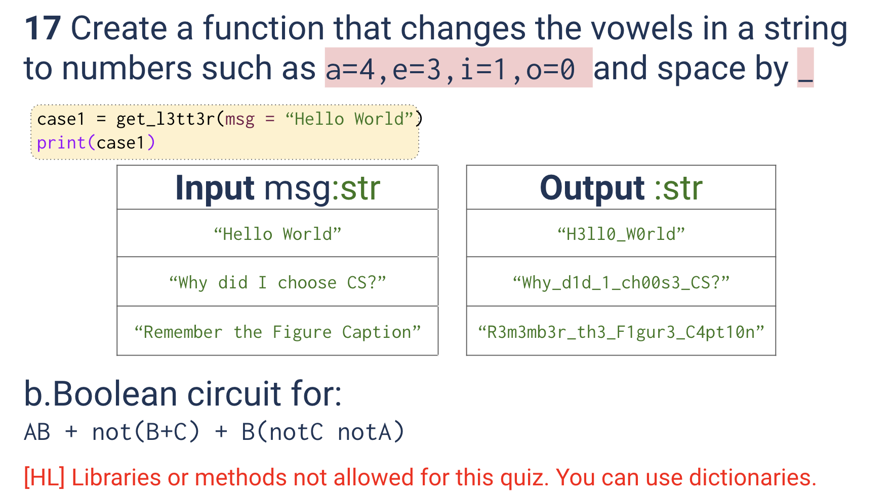
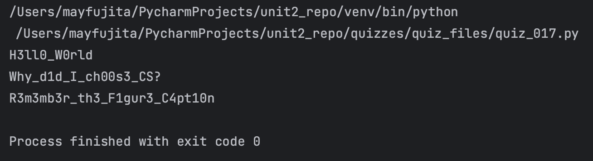
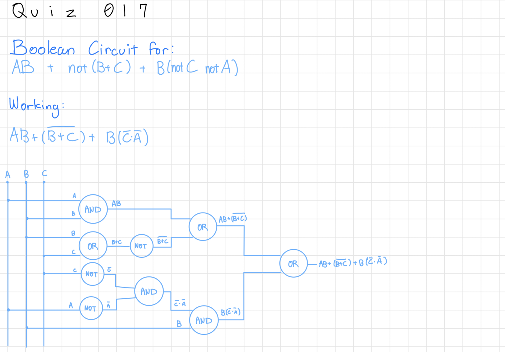

# Quiz 017
<hr>

### Prompt

*fig. 1* **Screenshot of quiz slides**

### Solution
```.py
def get_l3tt3r(msg:str)->str:
    vowels = {
        'a': '4',
        'e': '3',
        'i': '1',
        'o': '0',
        ' ': '_'
    }
    out = ""
    for let in msg:
        if let in vowels:
            out += vowels[let]
        else:
            out += let
    return out

# Check that it works:
print(get_l3tt3r(msg="Hello World"))
print(get_l3tt3r(msg="Why did I choose CS?"))
print(get_l3tt3r(msg="Remember the Figure Caption"))
```

### Evidence

*fig. 2* **Screenshot of output in console**

### Boolean Logic Problem

*fig. 3* **Working for given boolean logic problem**