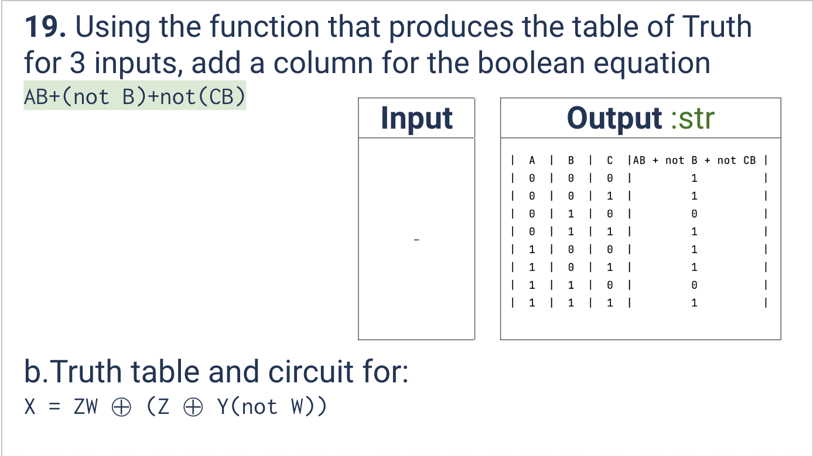
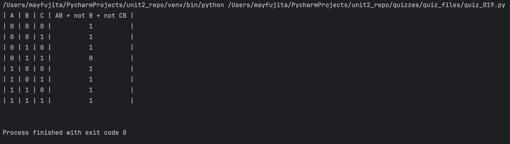

# Quiz 019
<hr>

### Prompt

*fig. 1* **Screenshot of quiz slides**

### Solution
```.py
def get_truth2():
    out = "| A | B | C | AB + not B + not CB |\n"
    A = 0
    B = 0
    C = 0
    eq = 1
    for n in range(8):
        out += f"| {int(A)} | {int(B)} | {int(C)} |          {int(eq)}          |\n"
        C = not(C)
        if (n+1) % 2 == 0:
            B = not(B)
        if (n+1) % 4 == 0:
            A = not(A)
        eq = (A and B) or (not B) or (not(B and C))
    return out

# Check if it works:
print(get_truth2())
```

### Evidence

*fig. 2* **Screenshot of output in console**

### Boolean Logic Problem

*fig. 3* **Working for given boolean logic problem**