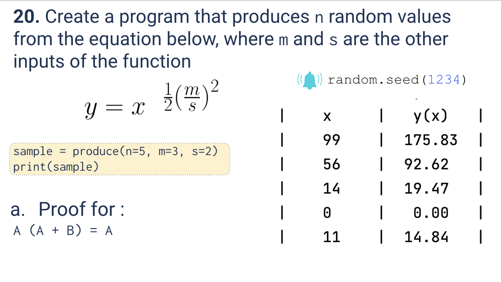
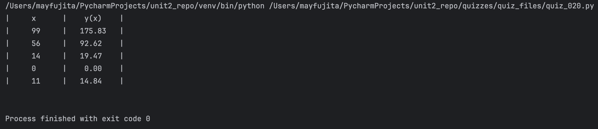
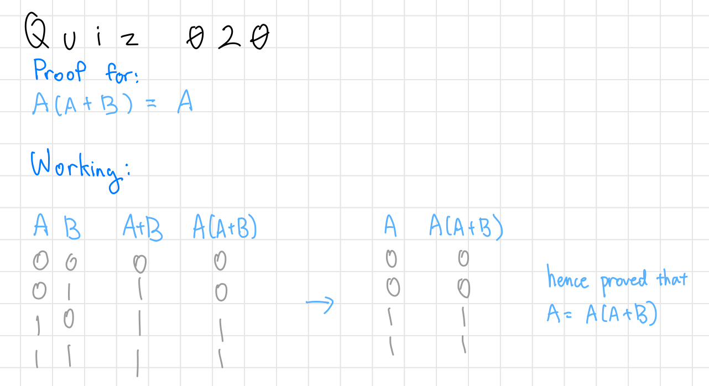

# Quiz 020
<hr>

### Prompt

*fig. 1* **Screenshot of quiz slides**

### Solution
```.py
import random
random.seed(1234)

def produce(n:int, m:int, s:int)-> float:
    out = f"|{'x'.center(12)}|{'y(x)'.center(12)}|\n"
    for n in range(5):
        x = random.randint(0,100)
        y = x**(0.5*((m/s)**2))
        out += f"|  {str(x).center(8)}  |  {f'{y:.2f}'.center(8)}  |\n"
    return out

# Check that it works
print(produce(n=5, m=3, s=2))
```

### Evidence

*fig. 2* **Screenshot of output in console**

### Boolean Logic Problem

*fig. 3* **Working for given boolean logic problem**