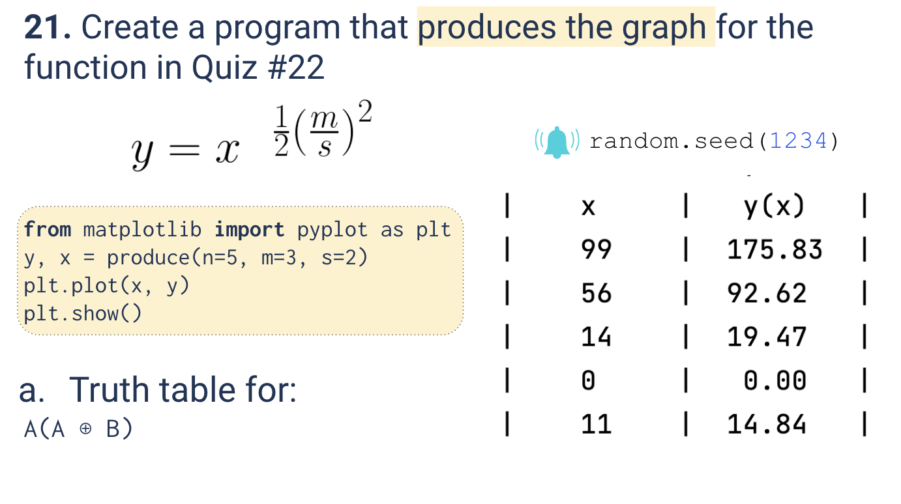
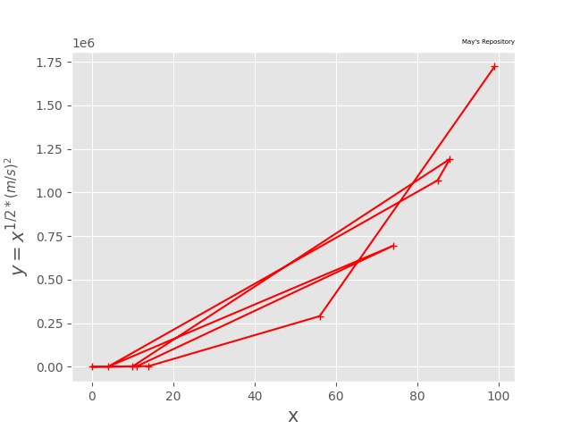

# Quiz 021
<hr>

### Prompt

*fig. 1* **Screenshot of quiz slides**

### Solution
```.py
def produce(n:int, m:int, s:int)-> tuple:
    x_out = []
    y_out = []
    for _ in range(n):
        x = random.randint(0,100)
        y = x ** (0.5*((m/s)**2))
        x_out.append(x)
        y_out.append(y)
    return y_out, x_out

plt.style.use('ggplot')
y, x = produce(n=10, m=5, s=2)
plt.plot(x,y, color='r', marker="+")
plt.xlabel("x", fontsize=15)
plt.ylabel("$y =x^{1/2*{(m/s)^2}}$", fontsize=15)
plt.show()
```

### Evidence

*fig. 2* **Screenshot of output in console**

### Boolean Logic Problem

*fig. 3* **Working for given boolean logic problem**