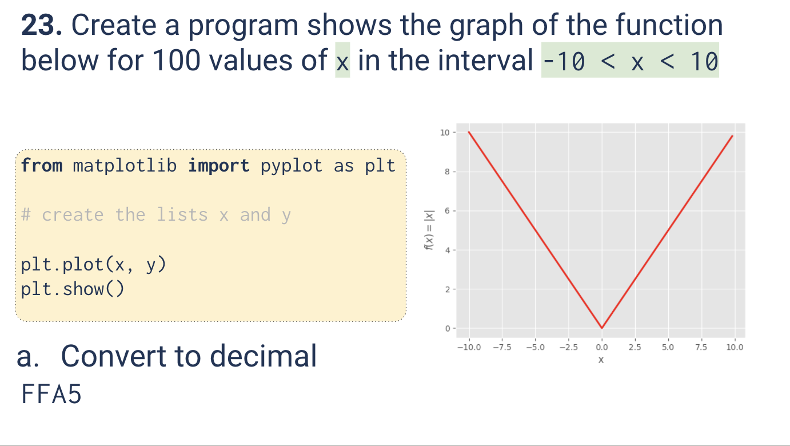
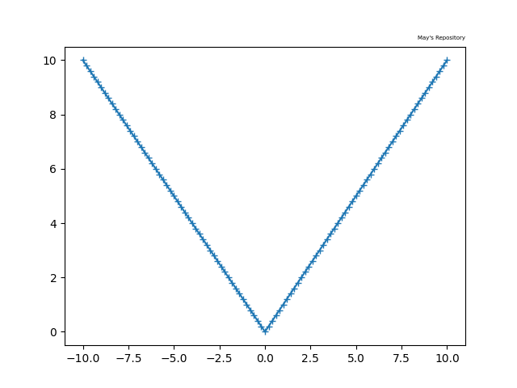
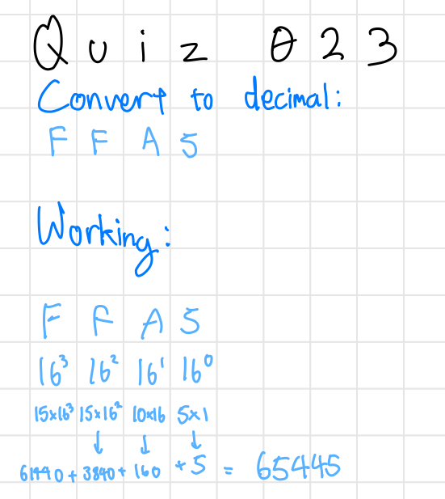

# Quiz 023
<hr>

### Prompt

*fig. 1* **Screenshot of quiz slides**

### Solution
```.py
from matplotlib import pyplot as plt

x = []
y = []

i = -10
while i<=10:
    x.append(i)
    y.append(abs(i))
    i += 0.2

plt.plot(x, y, marker='+') # Markers just to show that there are 100 points in the graph
plt.title("May's Repository", fontsize=5, loc="right")
plt.show()
```

### Evidence

*fig. 2* **Screenshot of output graph**

### Base Conversion Problem

*fig. 3* **Working for given base conversion problem**