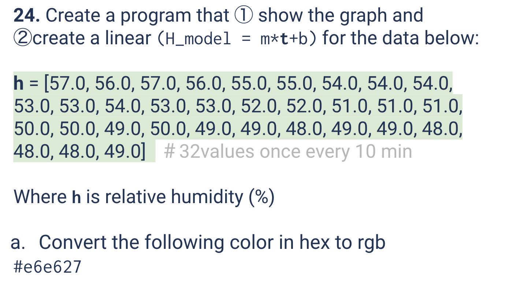
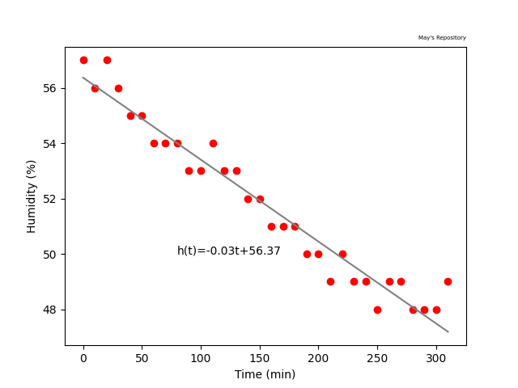
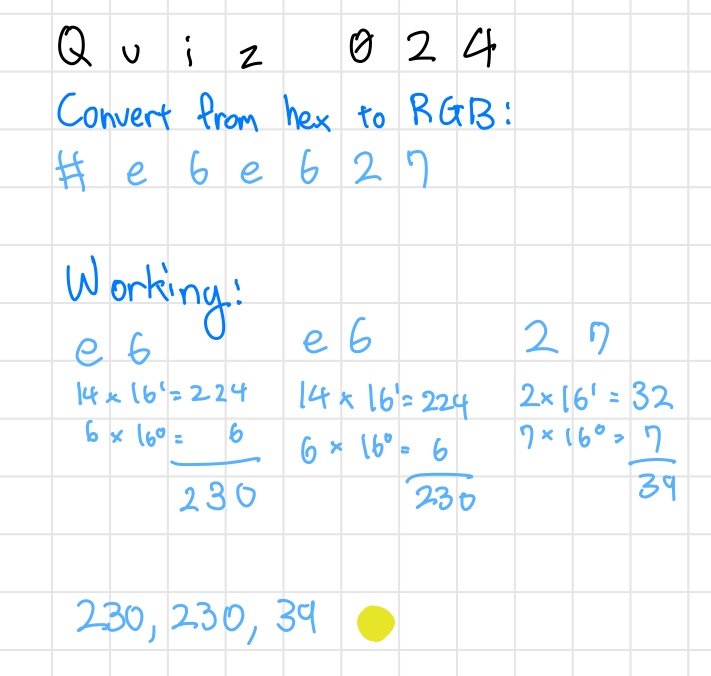

# Quiz 024
<hr>

### Prompt

*fig. 1* **Screenshot of quiz slides**

### Solution
```.py
import matplotlib.pyplot as plt
import numpy as np

humidity = [57, 56, 57, 56, 55, 55, 54, 54, 54, 53, 53, 54, 53, 53, 52, 52, 51, 51, 51, 50, 50, 49, 50, 49, 49, 48, 49, 49, 48, 48, 48, 49]
time = []

t=0
for n in range(len(humidity)):
    time.append(t)
    t += 10

plt.scatter(time, humidity, color="red")
plt.xlabel("Time (min)")
plt.ylabel("Humidity (%)")

m, b = np.polyfit(time, humidity, 1)
print(f"Linear model h(t) = {m:.2f}t+{b:.2f}")

time_model = []
humidity_model = []
t = 0
for i in range(len(humidity)):
    time_model.append(t)
    humidity_model.append(m * t + b)
    t += 10
    
plt.plot(time_model, humidity_model, color="gray")
plt.text(80, 50, f"h(t)={m:.2f}t+{b:.2f}", fontsize=10)
plt.title("May's Repository", fontsize=5, loc="right")
plt.show()
```

### Evidence

*fig. 2* **Screenshot of output graph**

### Base Conversion Problem

*fig. 3* **Working for given base conversion problem**