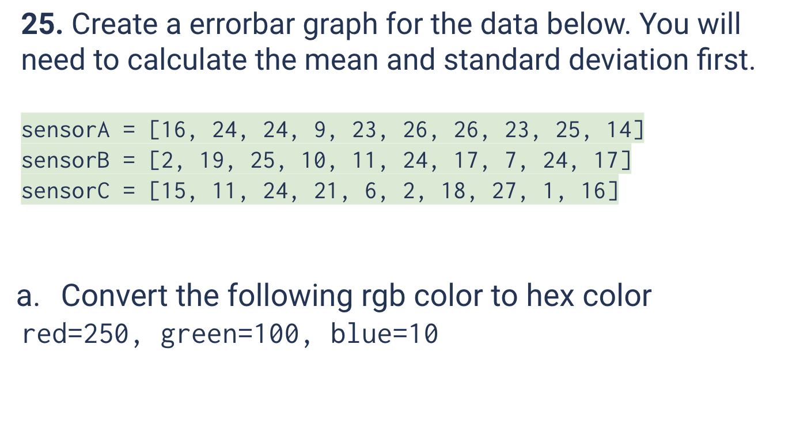
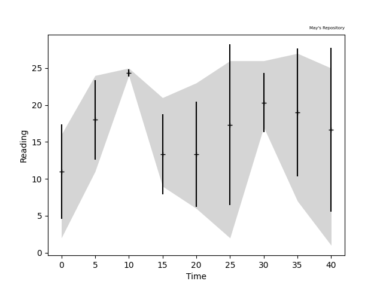

# Quiz 025
<hr>

### Prompt

*fig. 1* **Screenshot of quiz slides**

### Solution
```.py

```

### Evidence

*fig. 2* **Screenshot of output in console**

### Boolean Logic Problem

*fig. 3* **Working for given boolean logic problem**